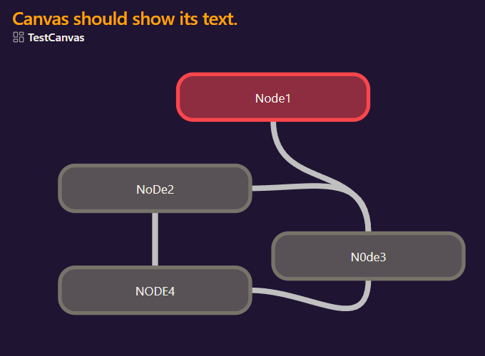

# Embedded Canvas Improvements

This Obsidian Plugin improves the way that canvases are embedded as the name already suggests and it ˢʰᵒᵘˡᵈ adapt to the current Theme. The main improvement is that every Node now shows its corresponding Text. I also plan on making this work for images that are in canvases, arrow connections between Nodes and a on-hover Zoom because the text will get fairly small once the canvas gets a bit bigger since the embed size doesn't change.

Heres an example of the plugin: 

## Exclamer
Let me know if you want anything added but keep in mind that this is the first time I've used typescript or javascript for that matter so don't be surprised if the code is a bit wonky. Also I haven't tested it on mobile yet.

## Why?
I've used Obsidian for about a week now and whenever I need to export my files as a PDF for uni it bothered me that I had to send the canvas as a seperate file so I made this in a day and so far it fulfills my needs but I will continue to work on it and add further features for a pleasant experience.